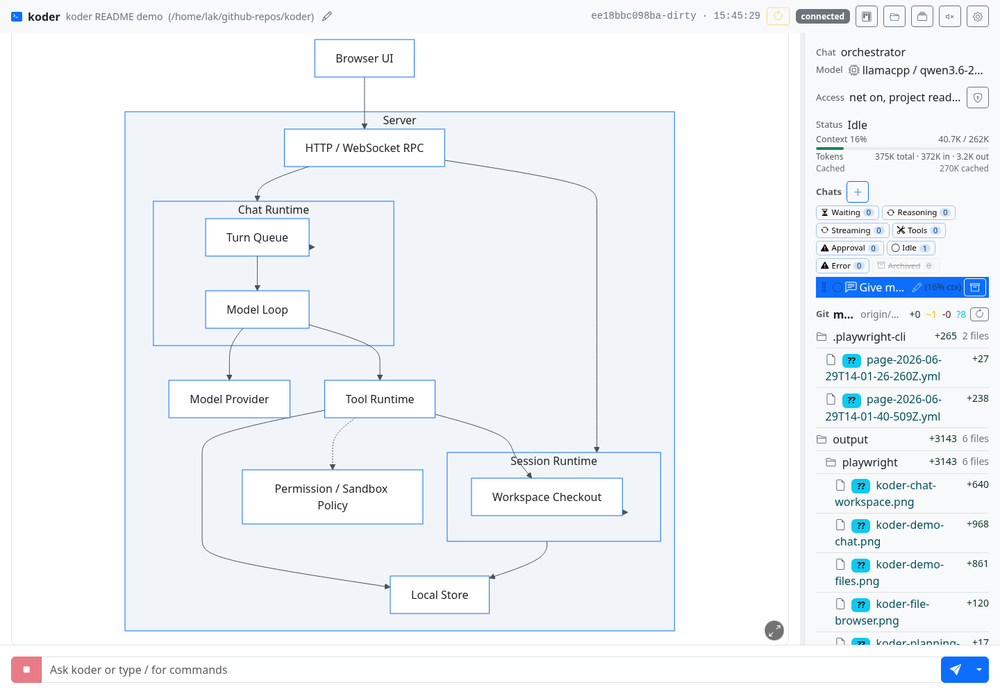

# koder

`koder` is a local-first, browser-based coding agent for real repositories. It gives an OpenAI-compatible model a structured tool surface, persistent sessions, repo-aware file browsing, task planning, permissions, MCP integrations, skills, and enough observability to understand what happened after a long run.

It is built for developers who want an agent that can stay close to the codebase: inspect files, search with structured results, edit safely, run commands when allowed, split work into milestones and tasks, and leave a readable trail in the browser.


## Why Koder?

- **Bring your own model.** Use local or remote OpenAI-compatible `/v1/chat/completions` providers, configure models in the UI, and choose separate models for normal work, compaction, and TTS when useful.
- **Work in a real browser UI.** Manage sessions, chats, providers, permissions, tools, MCP servers, file browsing, and planning state from one place.
- **Keep sessions inspectable.** Chats, tool calls, tool results, approvals, context usage, compaction summaries, milestones, and tasks are persisted locally.
- **Use safer code tools.** The model gets typed tools for reading, globbing, grep-style search, semantic code search, targeted edits, explicit full-file writes, shell/exec sessions, image viewing, web fetch/search, skills, and task orchestration.
- **Avoid accidental rewrites.** Targeted changes go through `edit`. The `write` tool creates new files by default and refuses to overwrite an existing file unless `force_overwrite=true`.
- **Plan and execute in parallel.** Milestones, tasks, and controlled background chats let an orchestrator plan while execution chats work on scoped items.
- **Review the repo visually.** The file browser renders source, markdown, Mermaid diagrams, and media without leaving the session.
- **Customize behavior.** Managed prompts and bundled skills are user-editable under the Koder data directory.
- **Inspect what happened.** Local debug APIs expose runtime state, sessions, transcripts, events, and HTTP activity for troubleshooting.

## Screenshots




## How It Works

Koder runs as a local Go process. The browser UI talks to that process over local HTTP and WebSocket connections. Each session has its own workspace root, chats, settings, permissions, transcript, and file watcher. The chat runtime talks to the selected model provider and exposes structured tools instead of asking the model to guess at raw terminal workflows.

The core tool surface includes:

- `read`, `glob`, `grep`, and `code_search` for understanding a repo.
- `edit` for targeted replacements in existing files.
- `write` for new files or explicit full-file overwrites.
- `bash` and `exec_*` for command execution when allowed.
- milestone, task, and `chat_start` tools for organizing larger work.
- `skill`, MCP, web, image, markdown, Mermaid, and diagnostic tools for richer workflows.

Permission profiles control network access, root filesystem mode, workspace mode, additional mounts, and per-tool policy. On Linux, shell sandboxing uses `bwrap` when shell tools are enabled.

## Quick Start

Download the latest Linux x64 or Linux arm64 build from GitHub Releases, then run:

```bash
chmod +x koder-rNNNN-linux-amd64
./koder-rNNNN-linux-amd64 serve
```

Or build from source:

```bash
git clone https://github.com/lkarlslund/koder.git
cd koder
scripts/build-koder
.bin/koder serve
```

By default, Koder binds the web UI on a local ephemeral port and opens your browser. To choose the address or avoid opening a browser:

```bash
koder serve --web-bind 127.0.0.1:8080
koder serve --nobrowser
```

To run a separate instance with isolated config, sessions, cache, and managed assets, use a separate data directory:

```bash
koder --data-dir /tmp/koder-test serve --web-bind 127.0.0.1:7980 --nobrowser
```

Check configuration and provider connectivity:

```bash
koder doctor
```

## Providers

Koder does not require a specific hosted service. Configure one or more OpenAI-compatible providers in Preferences or in `config.toml`, then pick the default model from the web UI.

Example local provider:

```toml
[defaults]
provider_id = "local-llama"
model_id = "qwen3-coder"

[compaction]
auto_at_percent = 85
keep_tool_calls = 2

[providers.local-llama]
name = "Local llama.cpp"
base_url = "http://127.0.0.1:8888/v1"
stream = true
timeout = "10m"

[[models]]
provider_id = "local-llama"
model_id = "qwen3-coder"
context_window = 32768
```

Compaction can use the active chat model or a separate configured model. This is useful when your main coding model is expensive, slow, or not ideal for summarizing long histories.

## Feature Highlights

| Area | What it gives you |
| --- | --- |
| Chat workspace | Multi-chat sessions, queued user messages, steering messages, context tracking, compaction, and TTS output. |
| Code tools | Structured read/search/edit/write tools with diagnostics after edits. |
| File browser | Tree navigation, URL-addressable files, source rendering, markdown preview, Mermaid diagrams, and media lightboxes. |
| Planning board | Milestones and tasks that both the user and orchestrator can maintain. |
| Background work | Controlled sub-chats for execution while the orchestrator stays in charge. |
| Providers | OpenAI-compatible local or hosted models, per-model JSON customization, and model selection dialogs. |
| Permissions | Per-session access settings, tool policy, network policy, and Linux shell sandboxing. |
| Debugging | `/debug` endpoints for runtime state, sessions, transcripts, events, chats, and HTTP activity. |

## Requirements

- Linux x64 or Linux arm64 for release binaries.
- Go toolchain for building from source.
- At least one OpenAI-compatible model provider.
- `rg` is optional; search falls back to a Go implementation when ripgrep is unavailable.
- `bwrap` is required for sandboxed shell command execution on Linux.

## Useful Commands

```bash
koder serve
koder --data-dir /tmp/koder-test serve
koder serve --web-bind 127.0.0.1:8080
koder serve --nobrowser
koder doctor
koder doctor --provider local-llama --model qwen3-coder
koder doctor --tts
koder debug info
koder debug tail --session <session-id> --url http://127.0.0.1:7979
koder session --help
koder skill --help
koder version
```

## Debug API

Koder exposes debug endpoints on the same web server as the UI. If the UI is running at `http://127.0.0.1:44323`, the debug API is under `http://127.0.0.1:44323/debug`.

Useful endpoints include:

- `/debug/runtime`
- `/debug/sessions`
- `/debug/sessions/<id>/transcript`
- `/debug/sessions/<id>/events`
- `/debug/chats`
- `/debug/http`

See [docs/debug-api.md](docs/debug-api.md) for details.

## Development

For normal local development:

```bash
go test ./cmd/... ./internal/...
go build ./cmd/koder
```

For release-style build metadata in `koder version` and the debug API:

```bash
scripts/build-koder
```

That injects version, commit, dirty state, and build time into the binary via Go linker flags.
