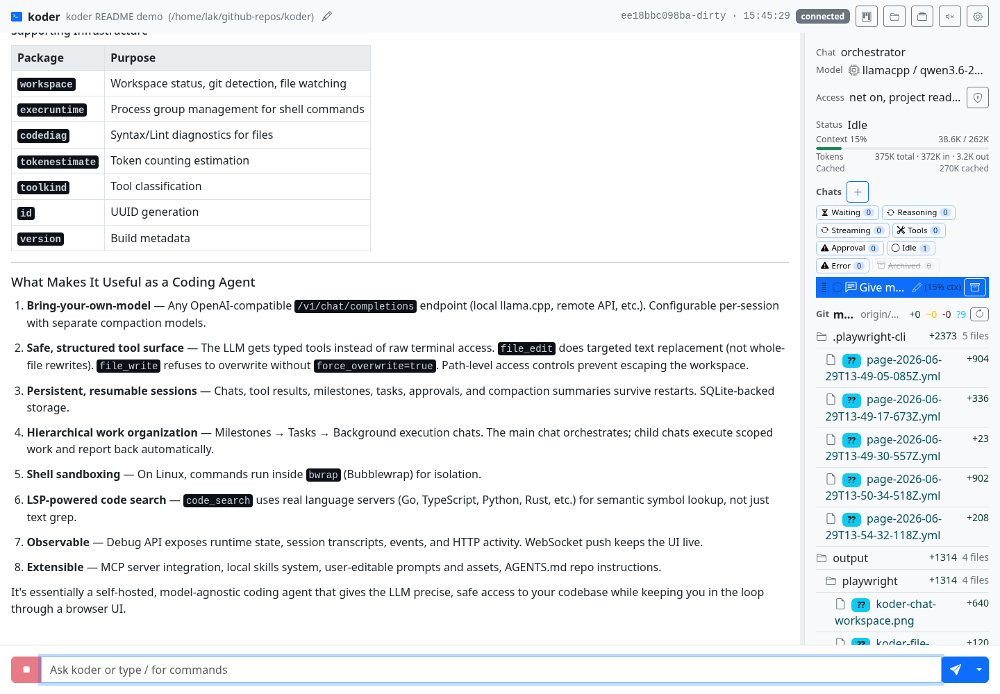
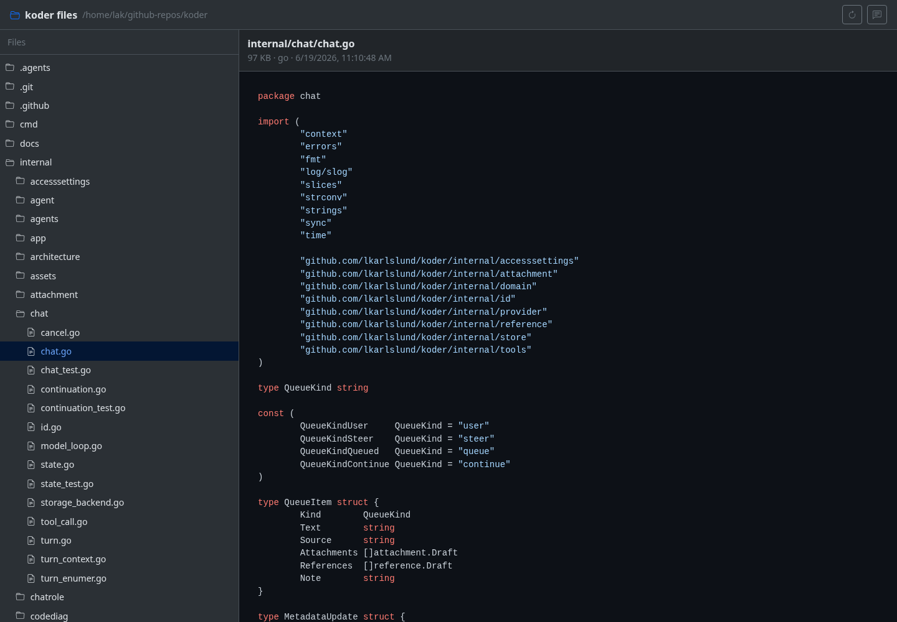

#  koder

Local-first coding and computer use agent. It runs as a single local Go process, serves multiple sessions via browser UI, and connects to your choice of OpenAI-compatible model providers.

Nice features from being browser based: multiple live sessions, rich chat rendering, visual file browsing, planning boards, model settings, permissions, TTS controls, approvals, debug traces, and repo state all stay visible and inspectable.

Author's current setup: Linux, local `llama.cpp`, Qwen 3.6 27B Q8 for 256K-token chat sessions, and a Qwen 3.5 4B summarizer model for compaction.



## Use Cases

- **Software development in real repositories.** Let the agent inspect code, search with structured tools, make targeted edits, run checks, explain failures, and keep a persistent trail of what changed.
- **Long-running investigations.** Keep multiple chats open for hypotheses, experiments, review, and follow-up while the session preserves tool output, approvals, summaries, and context usage.
- **Reverse engineering and security research.** Use repo tools, command execution, notes, file browsing, image viewing, and planning boards to work through unfamiliar code, binaries, traces, protocols, and generated artifacts.
- **Designing generated objects with visual feedback.** Iterate on things like OpenSCAD models, diagrams, generated images, reports, or markdown documents while both user and model can inspect rendered output.
- **Local-model workflows.** Run against `llama.cpp` or another OpenAI-compatible provider, tune custom model request JSON, use prompt-progress diagnostics, and keep sensitive work on your own machine.
- **Planning and delegating larger work.** Track milestones and tasks in the UI while an orchestrator chat manages scope and controlled execution chats handle focused pieces.

## Screenshots




## Quick Start

Download the latest Linux x64 or Linux arm64 build from GitHub Releases:

```bash
chmod +x koder-rNNNN-linux-amd64
./koder-rNNNN-linux-amd64 serve
```

Or build from source:

```bash
git clone https://github.com/lkarlslund/koder.git
cd koder
scripts/build-koder
.bin/koder serve
```

By default, Koder binds to a local ephemeral port and opens your browser. To choose the address or keep the browser closed:

```bash
koder serve --web-bind 127.0.0.1:8080
koder serve --nobrowser
```

Use a separate data directory when testing another instance:

```bash
koder --data-dir /tmp/koder-test serve --web-bind 127.0.0.1:7980 --nobrowser
```

Check configuration and provider connectivity:

```bash
koder doctor
```

## Providers And Models

Koder does not require a specific hosted service. Configure providers in Preferences or in `config.toml`, then choose the default model in the UI.

Example local `llama.cpp` provider:

```toml
[defaults]
provider_id = "local-llama"
model_id = "qwen3-coder"

[compaction]
auto_at_percent = 85
use_chat_model = true

[providers.local-llama]
kind = "openai-compatible"
name = "Local llama.cpp"
base_url = "http://127.0.0.1:8888/v1"
stream = true
timeout = "10m"

[[models]]
provider_id = "local-llama"
model_id = "qwen3-coder"
context_window = 32768
```

Detected models are read-only. If a model needs special request settings, create a custom model from it and edit the JSON request options in the model dialog. Koder can use separate models for chat, compaction, thinking helpers, and TTS when that is useful.

## How It Works

Each session has its own repository root, chats, settings, permissions, transcript, and file watcher. The browser UI talks to the local Koder process over HTTP and WebSocket. The Koder process talks to the selected model provider and executes approved local tools.

The model sees a structured tool surface instead of a vague shell-only environment:

| Area | Tools and behavior |
| --- | --- |
| Repository understanding | `read`, `glob`, `grep`, code search, file tree browsing, image viewing |
| Editing | targeted `edit`, explicit full-file `write`, post-edit diagnostics where supported |
| Execution | shell commands, long-running exec sessions, command output capture, exit codes |
| Planning | milestones, tasks, status updates, planning board, controlled sub-chats |
| Context | context tracking, compaction, image-capability checks, prompt-progress diagnostics |
| Extensions | MCP tools, skills, web fetch/search, markdown and Mermaid validation |

## Feature Highlights

| Feature | What it is for |
| --- | --- |
| Browser-native multi-session workspace | Keep several repositories, chats, and investigations open in one local process without pretending everything is one terminal buffer. |
| Shared human/agent planning board | Milestones and tasks are editable by both the user in the UI and the model through tools, so planning state is not trapped in chat prose. |
| Controlled background execution chats | Let an orchestrator chat stay in charge while scoped sub-chats execute work, with limits on concurrent non-idle child chats. |
| Queue, steer, and send-now controls | Add normal queued messages, steer a running turn, promote/demote queued messages, or abort the current turn and send a new instruction immediately. |
| Visual artifact feedback loop | Browse rendered markdown, Mermaid diagrams, images, and generated files so both user and model can iterate on visual output, not just raw text. |
| Local model diagnostics | Detect `llama.cpp` context/slot behavior, show prompt-progress/cache signals, and expose provider HTTP traces when cache reuse or streaming looks wrong. |
| Custom model variants | Create derived models with custom request JSON, defaults, TTS settings, thinking settings, and compaction choices without changing the backing provider. |
| Session-scoped safety controls | Permissions, sandboxing, network policy, workspace access, mounts, approvals, and model choices belong to the session instead of a hidden global state. |
| Inspectable persistence and debug API | Local transcripts, tool output, approvals, planning data, events, and HTTP traces remain available for review and troubleshooting after long runs. |

## Requirements

- Linux x64 or Linux arm64 for release binaries.
- Go toolchain when building from source.
- At least one OpenAI-compatible model provider.
- `rg` is optional; search falls back to a Go implementation when ripgrep is unavailable.
- `bwrap` is currently required for sandboxed shell command execution on Linux.
- macOS and Windows can run the web UI and non-shell features, but shell sandboxing is currently Linux-oriented.

## Useful Commands

```bash
koder serve
koder --data-dir /tmp/koder-test serve
koder serve --web-bind 127.0.0.1:8080
koder serve --nobrowser
koder doctor
koder doctor --provider local-llama --model qwen3-coder
koder doctor --tts
koder debug info
koder debug tail --session <session-id> --url http://127.0.0.1:7979
koder session --help
koder skill --help
koder version
```

## Debug API

Koder exposes debug endpoints on the same web server as the UI. If the UI is running at `http://127.0.0.1:44323`, the debug API is under `http://127.0.0.1:44323/debug`.

Useful endpoints include:

- `/debug/runtime`
- `/debug/sessions`
- `/debug/sessions/<id>/transcript`
- `/debug/sessions/<id>/events`
- `/debug/chats`
- `/debug/http`

See [docs/debug-api.md](docs/debug-api.md) for details.

## Build

For normal local development:

```bash
go test ./...
go build ./cmd/koder
```

For release-style build metadata in `koder version` and the debug API:

```bash
scripts/build-koder
```

That injects version, commit, dirty state, and build time into the binary with Go linker flags.
